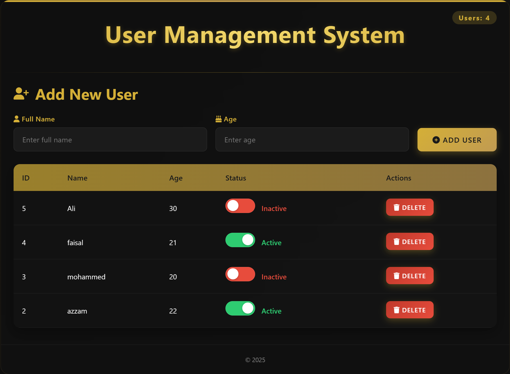

# user_website



## Table of Contents
- [Features](#features)
- [Technologies Used](#technologies-used)
- [Installation](#installation)
- [Database Setup](#database-setup)
- [Usage](#usage)
- [Code Structure](#code-structure)
- [Contributing](#contributing)
- [License](#license)

## Features

### ✨ Luxury Dark Theme
- Sophisticated black background with gold accents
- Premium design with subtle animations and transitions
- Responsive layout for all device sizes
- Elegant typography with gradient text effects

### 👥 User Management
- **Add Users**: Simple form to add new users with name and age
- **Status Toggling**: Real-time toggle between Active/Inactive status
- **Delete Users**: Remove users with confirmation dialog
- **User Count**: Dynamic user counter in header

### ⚡ Real-time Operations
- Immediate status updates with visual feedback
- Smooth UI transitions after database operations
- Beautiful notifications for all actions

### 🔒 Database Integration
- Automatic database and table creation
- Secure database interactions
- Persistent data storage

## Technologies Used

- **Frontend**: 
  - HTML5, CSS3 (Flexbox, Grid, Animations)
  - JavaScript (ES6)
- **Backend**: 
  - PHP (PDO for database access)
- **Database**: 
  - MySQL
- **Libraries**:
  - Font Awesome (Icons)
  - SweetAlert2 (Beautiful alerts)
- **Styling**: 
  - CSS Variables
  - Gradient Effects
  - Responsive Design Principles

## Installation

### Step 1: Environment Setup
```bash
# Install XAMPP (Windows) or MAMP (Mac)
# Start Apache and MySQL services
